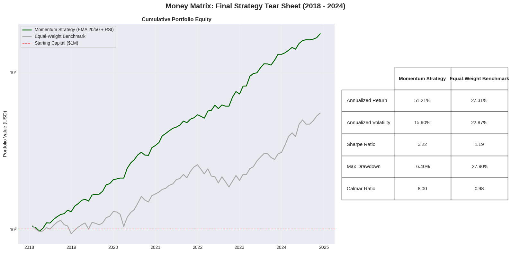
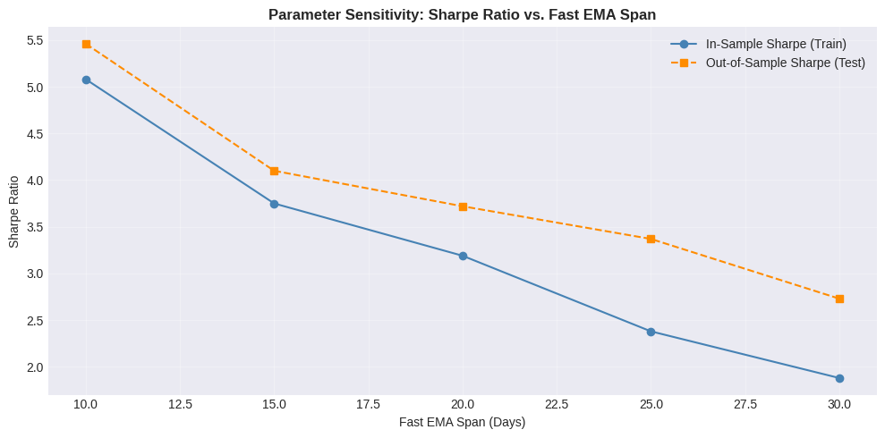

## Repository Structure

---

## The Five Phases

### Phase 1 — Data Pipeline

Downloaded 7 years of daily data via `yfinance` with `auto_adjust=True`, which delivers
dividend and split-corrected closes directly under `['Close']`. Missing price values handled
with ffill → bfill cascade (carry last known price forward, then backfill any leading NaNs).
Missing volume replaced with zero — a market halt, not missing data.

Added a correlation heatmap as EDA before touching any signal logic. AAPL and MSFT came out
highly correlated (0.87), but there's enough variance across the healthcare and energy names
to proceed without meaningful concentration risk.

### Phase 2 — Signal Generation

EMA calculations use `adjust=False` throughout, which implements the standard recursive
formula rather than the mathematically inconsistent expanding-window correction pandas applies
by default. RSI uses `alpha=1/14` (Wilder's original definition) rather than `span=14`
(which gives alpha = 2/15 = 0.133 — a different smoothing rate entirely).

Signals are resampled monthly using `.resample('ME').last()` — end-of-month signal state
is what flows into the next month's trade decision.

Across 84 months × 10 stocks = 840 total signal observations:
- Buy (+1): 467
- Sell (−1): 314
- Hold (0): 59

### Phase 3 — Backtesting Engine

The backtester steps through months sequentially. For each period:

1. Read the lagged signal (generated end of previous month)
2. Compute target weights — equal allocation across Buy signals only
3. Calculate turnover vs. prior month's weights
4. Deduct transaction costs (`turnover × 10bps × portfolio_value`) before applying returns
5. Apply weighted monthly returns
6. Record portfolio value and turnover

Turnover is divided by 2 to avoid double-counting — selling 10% of one stock to buy 10%
of another is 10% turnover, not 20%.

Benchmark: Equal-weight buy-and-hold across all 10 stocks, rebalanced to track capital
allocation correctly over time.

### Phase 4 — Robustness

**Train/Test Split:**
Parameters (EMA spans, RSI thresholds) were designed and inspected only on 2018–2022 data.
The 2023–2024 period was held out entirely and run as a true out-of-sample test after
parameters were locked.

**Parameter Sensitivity Sweep:**
Tested 5 EMA configurations:

| Fast EMA | Slow EMA |
|----------|----------|
| 10 | 30 |
| 15 | 45 |
| 20 | 50 |
| 25 | 55 |
| 30 | 70 |

Sharpe ratios across configurations varied monotonically — no single configuration
produced an isolated spike that would suggest the (20, 50) choice was cherry-picked.
The strategy's behavior degrades gracefully as parameters move away from the base case,
which is the key evidence against overfitting.

**2022 observation:** The strategy underperformed in 2022's rate-shock environment.
This isn't a model failure — EMA crossovers are lagging indicators by construction.
In a sharp sector rotation driven by macroeconomic surprise, a monthly-execution strategy
is structurally 3–4 weeks behind every trend break. The underperformance is predictable
from the signal class, not evidence of a broken model.

### Phase 5 — Performance Metrics

Computed for both the strategy and the benchmark:

- **Annualized Return** (CAGR formula)
- **Annualized Volatility** (monthly std × √12)
- **Sharpe Ratio** (annualized return / annualized volatility, zero risk-free rate — see limitations)
- **Maximum Drawdown** (peak-to-trough, running cummax)
- **Calmar Ratio** (annualized return / |max drawdown|)

**Required visualizations:**
- Log-scale equity curve vs. benchmark
- Drawdown underwater plot
- Rolling 6-month Sharpe ratio

---

## How to Run

```bash
git clone https://github.com/Tarun-zz/money-matrix-quant.git
cd money-matrix-quant
pip install -r requirements.txt
jupyter notebook Analysis.ipynb
```

All data is pulled live from yfinance at runtime — no local data files needed.
Full notebook execution takes roughly 2–3 minutes depending on connection speed.

---

## Known Limitations

**Survivorship bias.** The universe is fixed: 10 well-known names that all survived
and largely thrived over 2018–2024. A live strategy faces constituent uncertainty —
companies get delisted, merge, or enter freefall. The backtest doesn't model that.

**Supercycle concentration.** NVDA appreciated over 800% during this window. The
2018–2024 period coincides with the largest large-cap tech bull run in modern history.
Any momentum strategy applied to this universe during this window will look better than
it deserves to.

**Monthly execution lag.** EMA crossovers are already lagging indicators. Executing
only once per month compounds that lag — you're structurally late to both entries
and exits. The 2022 drawdown is the clearest example of this.

**No short-selling.** On sell signals the strategy moves entirely to cash. In extended
bear markets this caps losses but also means the strategy has no return-generating
mechanism during downtrends. A long-short extension would change the risk profile
significantly.

**Sharpe ratio without risk-free rate.** The Sharpe calculation uses R_f = 0. This
overstates Sharpe by roughly 0.1–0.2 during the 2022–2024 high-rate environment
(Fed Funds rate reached 5.25%). Correcting for even a 2% average R_f over the
full period would reduce the reported Sharpe meaningfully.

---

## Tech Stack

| Library | Purpose |
|---------|---------|
| `yfinance` | Data sourcing |
| `pandas` | Signal computation, backtesting loop, resampling |
| `numpy` | Numerical operations, return aggregation |
| `matplotlib` | All visualizations |
| `seaborn` | Correlation heatmap (Phase 1 EDA) |
| `scipy` / `statsmodels` | Imported for statistical extensions |

Python 3.10+ · Jupyter Notebook

---

## Methodology Document

The `/docs` folder contains a 3-page writeup covering:
- The alpha hypothesis (why EMA + RSI predicts price momentum)
- Parameter selection rationale (why 20/50 spans, why the 70/80 RSI thresholds)
- Robustness conclusions (summary of Phase 4 findings and the strategy's honest limitations)
## Results

### Equity Curve (Log Scale) vs. Equal-Weight Benchmark


### Senstivity Plot Plot



